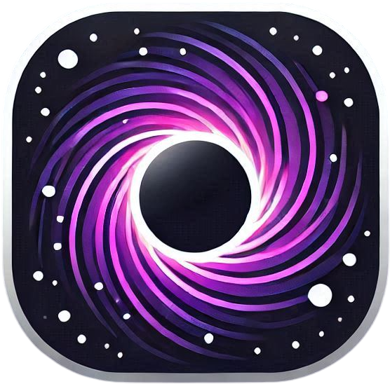

<div align="center">
   

   <h3 style="margin-top: 1px; margin-bottom: 0px; color: #e2e2e2ff; font-family: 'Times', sans-serif;">Nebularis Engine</h3><br>

   Nebularis Engine is a space simulation engine built with three.js. It enables enables real-time visualization of the Solar System with smooth animations and 3D rendering of celestial bodies.

   [](LICENSE)    
</div>

### Table of Contents:
- [Overview](#overview)
- [Installation](#installation)
   - [Prerequisites:](#prerequisites)
      - [Local Development:](#local-development)
- [Usage](#usage)
- [Roadmap](#roadmap)
- [License](#license)
- [Contributing](#contributing)

---
## Overview
- **Planet and Star Visualization**: Displays the eight planets of the Solar System, including the Sun, Earth’s Moon, and Saturn’s rings, with smooth animations.
- **Camera Movement**: Free navigation in the scene using keyboard and mouse.


<p align="center">
  
  
</p>


---
## Installation
###### Prerequisites:
- ###### [Node](https://nodejs.org/) v20.19+

#### Local Development:
1. **Clone the repository**
   ```bash
   git clone https://github.com/Noggurix/Nebularis-Engine.git
   cd nebularis-engine
   ```
2. **Install dependencies**
   ```bash
   npm install 
   ```
3. **Start local server**
   ```bash
   npm run dev
   ```

---
## Usage
- Navigate the scene using the WASD keys. Hold the left mouse button to rotate the camera, or click on a planet to focus on it.

---
## Roadmap
I plan to evolve Nebularis into a robust engine that allows users to build custom space simulations. Some of the future planned features are:

- **Realistic 3D Models**: Replace basic planet models with more realistic GLTF representations.
- **Realistic Physics Simulation**: Implementation of gravitational calculations, precise orbital simulations, and collisions between bodies based on Newton's laws.
- **Interactive UI**: Develop a control panel to manipulate the simulation in real time, allowing control over parameters such as orbit speed and planet positions.
- **Graphics Improvement**: A complete overhaul of the current graphics, using GLSL shaders and advanced post-processing.
- **Scene Management**: Possibility to manipulate different scenes, collaborate with others in real time, and save, load, or share them.

---
## License
This project is licensed under the GPL-3.0 License - see [LICENSE](./LICENSE) for details.

---
## Contributing
Contributions are welcome! Feel free to fork the project and open a pull request.